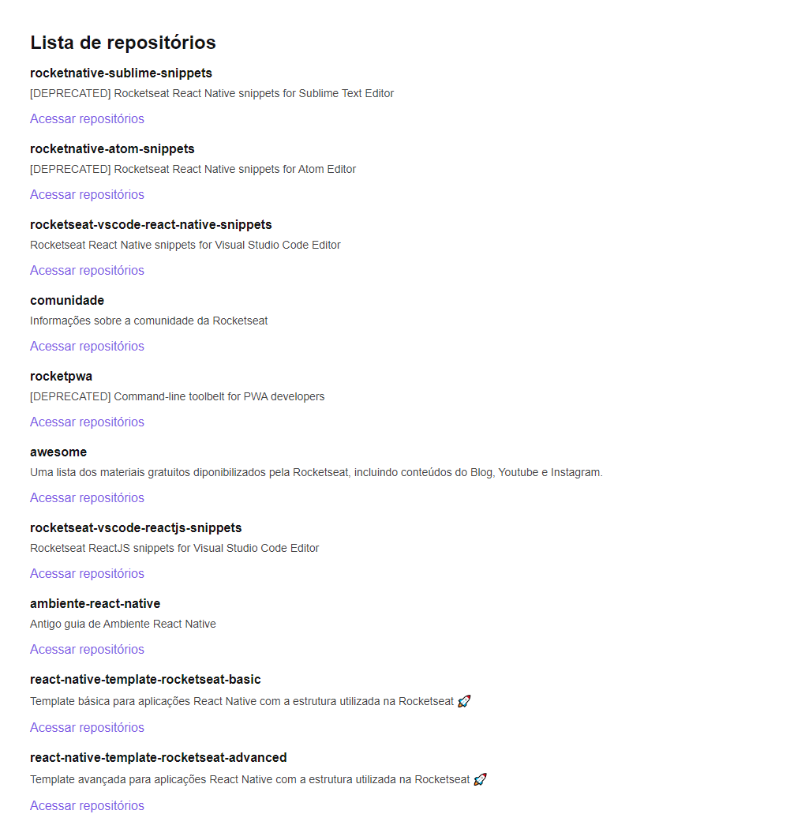

<div class="bg-gray-dark">
  <h1 align="center">
    GitHub Explorer
  </h1>
</div>

<p align="center">
  <a href="https://www.linkedin.com/in/samuel-macedo-12a420a8">
    
  </a>

  

  <a href="https://github.com/Samuca-sys/github-explorer/commits/main">
    
  </a>

  
</p>

## :pushpin: Menu
<!-- -->  
- [:one: About](#one-about)
- [:two: Technologies](#two-technologies)
- [:computer: Screenshot](#computer-screenshot)
- [:computer: How to run](#computer-how-to-run)
- [:closed_book: License](#closed_book-license)

## :one: About
Web app to search for RocketSeat repositories by github acess made for the first chapter of [RocketSeat Ignite](https://rocketseat.com.br/)


## :two: Technologies
This project was made using the following technologies:

* [Typescript](https://www.typescriptlang.org/)
* [ReactJS](https://pt-br.reactjs.org/)
* [Webpack](https://webpack.js.org/)
* [Babel](https://babeljs.io/)

## :computer: Screenshot
<div style="display: flex; flex-direction: 'row'; align-items: 'center';">
  
</div>

## :computer: How to run

```bash
# Clone o Repositório
$ git clone https://github.com/Samuca-sys/github-explorer
```

```bash
# Vá para a pasta do projeto
$ cd github-explorer

# Instale as depedencias
$ yarn install

# Rode a aplicação
$ yarn start
```
Available application url: http://localhost:8080/

## :closed_book: License

Released in 2021 :closed_book: License

Made by [Samuel Macedo](https://github.com/Samuca-sys) 🚀.
This project has [MIT license](./LICENSE).
